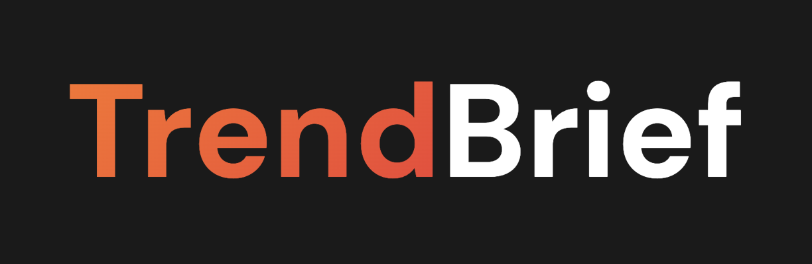
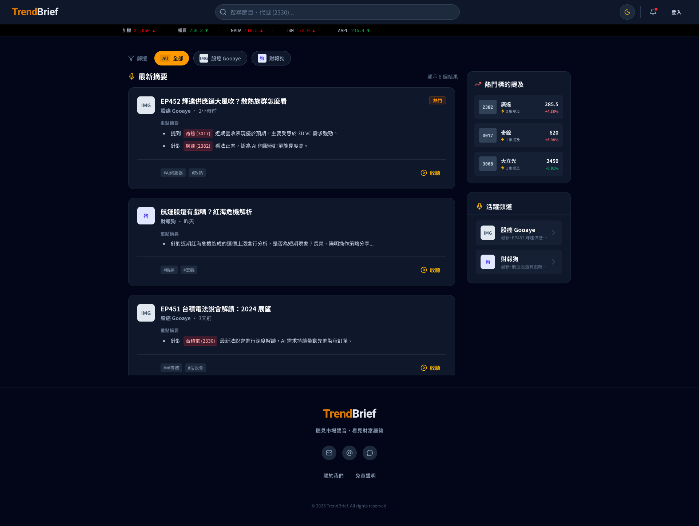
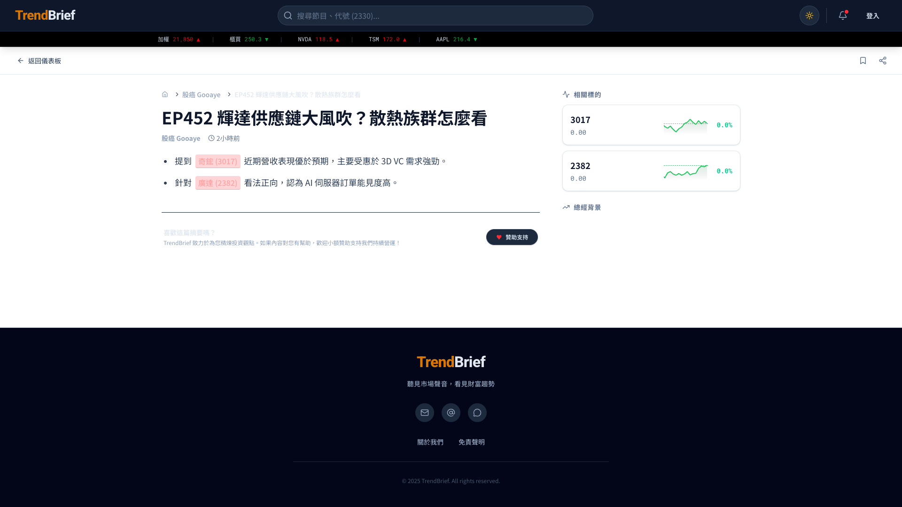
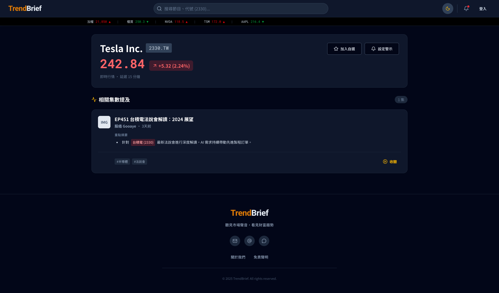
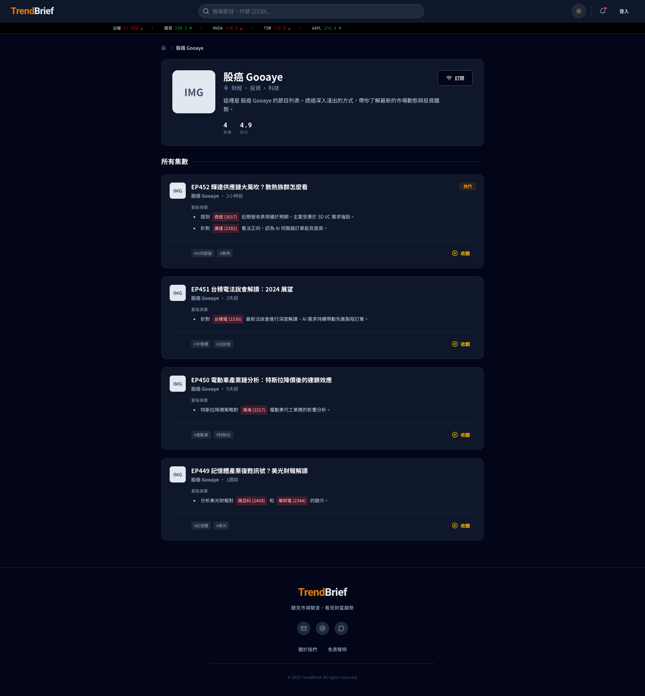
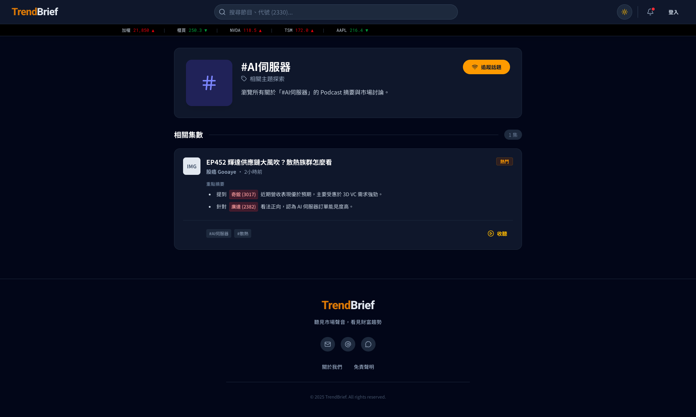

# TinBoker WebUI

<div align="center">
  
</div>

> Listen to the Market, See the Trend.

TinBoker is an interactive financial intelligence platform that combines podcast insights with real-time market data. It visualizes the connections between industry trends, company performance, and expert analysis, helping investors make informed decisions through an intuitive interface.

## Page Overview

TinBoker is organized into distinct content categories to help you navigate financial intelligence effectively.

### 🏠 Home Dashboard
The central command center. View the latest podcast summaries (feed), top market movers (tickers), and active channels.


### 📰 News & Podcast Detail
The core unit of content. Each page represents a specific podcast episode or news article, enriched with:
- **AI Summary**: Key takeaways and financial insights.
- **Interactive Tickers**: Mentioned stocks are clickable and show real-time data.
- **Tag Navigation**: Jump to related topics or channels.


### 📈 Ticker (Stock) Page
Comprehensive dashboard for individual stocks (e.g., TSMC, NVIDIA).
- **Real-time Price**: Live quotes and daily change.
- **Related Episodes**: A curated feed of all podcast episodes that have mentioned this specific stock.


### 🎙️ Channel Page
Dedicated page for specific content creators (e.g., "Gooaye", "Earnings Dog").
- **Episode Archive**: Browse all historical episodes from this channel.
- **Channel Stats**: (Future) Performance tracking of the channel's mentioned picks.


### 🏷️ Tag (Topic) Page
Aggregates content based on specific themes or industries (e.g., "#AI Server", "#Semiconductors").
- **Topic Feed**: See all news and episodes related to this specific theme across different channels.


## Key Features

### Smart Podcast Integration

### Smart Podcast Integration
- **Episode Summaries**: AI-powered summaries of popular financial podcasts (e.g., Gooaye, Earnings Dog) with interactive stock tickers.
- **Visual Highlights**: Interactive elements within summaries—hover over stock symbols mentioned in podcasts to see instant price charts and performance data.
- **Channel Filtering**: Easily filter content by your favorite podcasters or shows.

### Interactive Market Dashboard
- **Real-time Data**: Live stock prices, daily changes, and market mentions.
- **Interactive Charts**: TradingView-powered charts for deep technical analysis.
- **Graph Visualization**: Explore supply chain relationships and industry connections using interactive node graphs.

### Deep Dive Analysis
- **Stock Dashboard**: Comprehensive view for individual stocks including price history, related podcast episodes, and sector positioning.
- **Industry Analysis**: Visual heatmaps (TreeMap) and performance charts to spot sector-wide trends.
- **Concept Graphs**: Visualize complex industry relationships (e.g., AI Supply Chain, Robotics) with force-directed graphs.

### Modern UX/UI
- **Responsive Design**: Optimized experience across mobile, tablet, and desktop.
- **Dark/Light Mode**: Full theme support for comfortable viewing in any environment.
- **Interactive Widgets**: Draggable graphs, hover cards, and dynamic filters.

## Tech Stack

| Layer | Technology | Purpose |
|-------|-----------|---------|
| **Framework** | React 18 + TypeScript | Core application logic |
| **Styling** | Tailwind CSS + Shadcn UI | Responsive, accessible UI components |
| **Visualization** | React Flow + D3.js | Interactive graph visualizations |
| **Charting** | Lightweight Charts (TradingView) | High-performance financial charts |
| **State** | Zustand | Global state management |
| **Routing** | React Router v6 | Client-side navigation |
| **Build** | Vite | Ultra-fast build tool |
| **Markdown** | React Markdown | Rendering rich text content |

## Project Structure

```
src/
├── components/          # Reusable UI components
│   ├── auth/           # Authentication components
│   ├── charts/         # TradingView & D3 charts
│   ├── common/         # SEO, Breadcrumbs
│   ├── graph/          # React Flow graph visuals
│   ├── home/           # Dashboard widgets & cards
│   ├── layout/         # Header, Footer
│   ├── stock/          # Stock-specific displays
│   └── ui/             # Core design system components
├── data/               # Static & Mock data definitions
├── pages/              # Main route views
│   ├── Landing.tsx     # Home dashboard
│   ├── NewsPage.tsx    # Article & Podcast detail view
│   ├── StockDashboard.tsx # Individual stock analysis
│   └── ...
├── services/           # API integration
│   ├── api/            # Backend endpoints
│   └── websocket/      # Real-time price updates
└── store/              # Zustand stores
```

## Getting Started

### Prerequisites

- Node.js 18+
- npm or yarn

### Installation

```bash
# Clone the repository
git clone <repository-url>
cd Graphfolio-WebUI

# Install dependencies
npm install

# Start development server
npm run dev
```

The application will launch at `http://localhost:5173`

## Deployment

### Vercel (Recommended)

```bash
# Install Vercel CLI
npm i -g vercel

# Deploy
vercel
```

Or connect your GitHub repository to Vercel for automatic deployments.

## API Integration

The application supports a hybrid data model, capable of switching between mock data (for development/demo) and real backend APIs.

- **API Services**: Located in `src/services/api/`
- **WebSocket**: Real-time price updates handled in `src/services/websocket/`
- **Content Guidelines**: See `docs/news-content-guidelines.md` for backend content formatting rules.

## Contributing

1. Fork the repository
2. Create your feature branch (`git checkout -b feature/AmazingFeature`)
3. Commit your changes (`git commit -m 'Add some AmazingFeature'`)
4. Push to the branch (`git push origin feature/AmazingFeature`)
5. Open a Pull Request

---

Built with React, TypeScript, and Tailwind CSS
