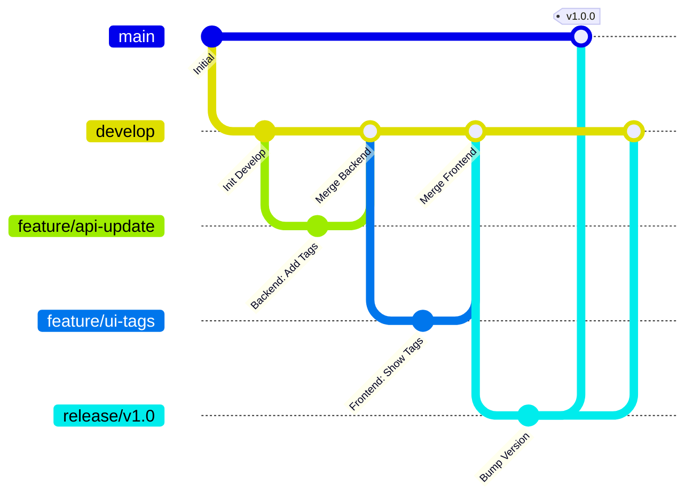

# Frontend-Backend Branching & Synchronization Strategy

This document outlines the branching strategy and workflow for maintaining synchronization between the **Graphfolio-WebUI** (Frontend) and **Graphfolio-Backend** (Backend) repositories.

## 1. Core Branches

Both repositories maintain two permanent branches:

| Branch | Environment | Purpose | Access |
| :--- | :--- | :--- | :--- |
| **`main`** | **Production** | Stable, deployable code. Reflects the live application. | Protected (PR only) |
| **`develop`** | **Staging / Beta** | Integration branch for new features. Deployed to Staging environment for testing. | Protected (PR only) |

### Environment Alignment
*   **Frontend `develop`** consumes **Backend `develop`** API.
*   **Frontend `main`** consumes **Backend `main`** API.

---

## 2. Development Workflow (Gitflow)

We use a variation of Gitflow to manage features and releases safely.

### A. Feature Development
*   **Branch:** `feature/feature-name` (e.g., `feature/spotify-integration`)
*   **Source:** `develop`
*   **Process:**
    1.  Create `feature/xxx` in **Backend** first (if API changes are needed).
    2.  Implement API changes and update `openapi.yaml`.
    3.  Create `feature/xxx` in **Frontend**.
    4.  Sync `openapi.yaml` from Backend `feature/xxx` to Frontend `feature/xxx`.
    5.  Implement UI/Logic using new API.
    6.  **Merge:** Backend PR to `develop` -> Frontend PR to `develop`.

### B. Release Candidate (Migration)
When `develop` contains a set of features ready for production:

*   **Branch:** `release/vX.X.X` (e.g., `release/v1.2.0`)
*   **Source:** `develop`
*   **Purpose:** Final testing, bug fixes, and version bumping. **No new features.**
*   **Process:**
    1.  Create `release/v1.2.0` in both repos.
    2.  Perform integration testing on Staging (pointing Frontend Release to Backend Release).
    3.  Fix bugs directly on `release/v1.2.0`.
    4.  **Merge:** Merge `release/v1.2.0` into **`main`** (deploy to Prod) AND back into **`develop`**.

### C. Hotfixes
For critical bugs in Production:

*   **Branch:** `hotfix/bug-description`
*   **Source:** `main`
*   **Process:**
    1.  Fix bug on `hotfix` branch.
    2.  Merge into **`main`** AND **`develop`**.

---

## 3. Synchronization Methodology

To ensure the Frontend never breaks due to Backend API changes:

### Phase 1: Backward Compatible Backend
*   Backend updates on `develop` should be **backward compatible** whenever possible (e.g., add new fields, don't remove old ones immediately).
*   If a breaking change is required, coordinate the merge timing.

### Phase 2: API Contract Sync
1.  Backend developer updates `src/schemas/openapi.yaml` (automatically generated or manual).
2.  Backend `develop` is updated.
3.  Frontend developer copies `openapi.yaml` to `src/schemas/openapi.yaml` in Frontend repo.
4.  Frontend types/client are updated (if auto-generated) or code is adjusted.

### Phase 3: Safe Migration (The "Intermediate" Branch)
If a major API refactor is risky, use an **Integration Branch**:

1.  **Backend:** Create `integration/v2-api`.
2.  **Frontend:** Create `integration/v2-ui`.
3.  Point Frontend `integration` to Backend `integration` (via env var `VITE_API_BASE_URL`).
4.  Test thoroughly.
5.  Merge both to their respective `develop` branches simultaneously.

---

## 4. Branching Diagram



## 5. Checklist for Merging

Before merging `develop` to `main`:

*   [ ] **Backend:** Is the API fully deployed and stable on Staging?
*   [ ] **Frontend:** Does the UI handle all edge cases (loading, error, empty states) from the Staging API?
*   [ ] **Sync:** Is `openapi.yaml` in Frontend identical to Backend `main` candidate?
*   [ ] **Smoke Test:** Have critical paths (Stock Detail, News Feed, Podcast Player) been verified?

## 6. Environment ConfigurationTo ensure the Frontend connects to the correct Backend environment (Develop vs. Main), we use distinct configuration strategies for **Local Development** and **CI/CD Deployment**.### A. CI/CD Deployment (Automated)
When deploying to platforms like Vercel, Netlify, or Render, use the platform's Environment Variable settings or GitHub Secrets.

*   **Production Environment (`main` branch):**
    *   Set `VITE_API_BASE_URL` = `https://api.graphfolio.com` (Production API)
*   **Preview/Staging Environment (`develop` branch):**
    *   Set `VITE_API_BASE_URL` = `https://api-dev.graphfolio.com` (Staging API)

**GitHub Secrets Example:**
If using GitHub Actions for build/deploy:
1.  Go to Repo Settings > Secrets and variables > Actions.
2.  Add `PROD_API_URL` and `STAGING_API_URL`.
3.  In workflow file:
    ```yaml
    - name: Build
      run: npm run build
      env:
        VITE_API_BASE_URL: ${{ github.ref == 'refs/heads/main' && secrets.PROD_API_URL || secrets.STAGING_API_URL }}
    ```### B. Local Development (Manual)
Developers' local machines cannot access GitHub Secrets. To prevent confusion and ensure everyone uses the same Staging API by default:1.  **Commit `.env.development` to Git:**
    *   Create a `.env.development` file in the repository root.
    *   Set `VITE_API_BASE_URL=https://api-dev.graphfolio.com` (or whatever the shared staging URL is).
    *   **Do NOT** include sensitive keys in this file. Only public configuration.
    *   This ensures `npm run dev` automatically picks up the shared Staging API.2.  **Local Overrides (`.env.local`):**
    *   If a developer needs to point to their *local* backend (e.g., `http://localhost:8000`), they should create `.env.local` (which is git-ignored).
    *   `VITE_API_BASE_URL=http://localhost:8000` in `.env.local` will override `.env.development`.### Summary of Precedence
1.  `.env.local` (Local overrides, ignored by git)
2.  `.env.development` (Shared staging config, committed to git)
3.  `.env` (Base config)
