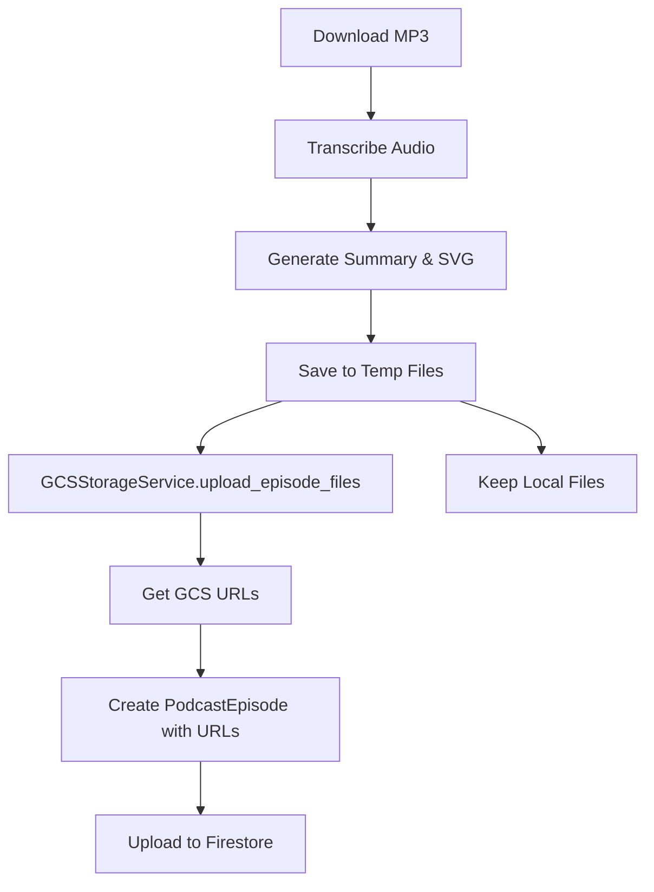

<!-- 1390c51b-42bd-4e7d-b16c-f9be16e96c14 7b84ab79-048c-491a-8d0e-f45c5f581cd1 -->
# GCS Storage Integration Plan

## Overview

Refactor the pipeline to upload intermediate files to Google Cloud Storage and store only URLs in Firestore, replacing the current approach of storing full content in Firestore documents.

## Architecture Changes

### Current Flow

```
Download → Transcribe → Summarize → Upload Content to Firestore
```

### New Flow

```
Download → Transcribe → Summarize → Upload Files to GCS → Store URLs in Firestore
```

## Implementation Steps

### 1. Create GCS Storage Service Module

**File**: `src/gcs_storage_service.py` (new file)

Create a centralized service for GCS operations:

- `GCSStorageService` class that handles:
  - File uploads to GCS with organized structure
  - URL generation (both `gs://` and public HTTPS URLs)
  - File organization by type: `mp3/`, `transcripts/`, `summaries/`, `images/`
  - Path structure: `{base_path}/{type}/{podcast_hash}/{episode_id}.{ext}`
  - Deduplication (check if file exists before upload)

Key methods:

- `upload_episode_files()` - Upload MP3, transcript, summary, and SVG for an episode
- `upload_file()` - Upload a single file to GCS
- `generate_gcs_url()` - Generate `gs://` URL
- `generate_public_url()` - Generate public HTTPS URL
- `get_file_path()` - Generate GCS blob path for a file type

### 2. Update PodcastEpisode Model

**File**: `src/models/podcast_models.py`

Modify the `PodcastEpisode` dataclass:

- Change `transcript: str` → `transcript_url: str` (GCS URL)
- Change `summary_content: str` → `summary_url: str` (GCS URL)
- Change `summary_image: str` → `summary_image_url: str` (GCS URL)
- Change `raw_mp3: str` → `mp3_url: str` (GCS URL)
- Add optional fields for public URLs:
  - `mp3_public_url: Optional[str]`
  - `transcript_public_url: Optional[str]`
  - `summary_public_url: Optional[str]`
  - `summary_image_public_url: Optional[str]`

Update `to_firestore_dict()` to serialize URLs instead of content.

### 3. Update Firebase Upload Service

**File**: `src/upload_to_firebase.py`

Modify `upload_podcast_data()` method:

- Accept `GCSStorageService` instance
- Before uploading to Firestore, upload files to GCS via `GCSStorageService`
- Store GCS URLs in Firestore instead of content
- Handle upload errors gracefully

### 4. Update Main Pipeline

**File**: `main.py`

Modify `process_episode_streaming()` function:

- Initialize `GCSStorageService` early in the pipeline
- After generating transcript, summary, and SVG:
  - Save content to temp files (for GCS upload)
  - Upload all files to GCS using `GCSStorageService`
  - Get URLs from GCS service
  - Create `PodcastEpisode` with URLs instead of content
  - Upload to Firestore
  - Keep temp files (per user preference)

For file-based mode:

- Upload existing local files to GCS
- Store URLs in Firestore
- Keep local files (per user preference)

### 5. Update File-Based Upload Flow

**File**: `main.py` (file-based mode section)

In the upload step (Step 4):

- Instead of reading file contents, upload files to GCS
- Get URLs from GCS service
- Store URLs in Firestore

### 6. GCS File Organization Structure

Files will be organized in GCS as:

```
{base_path}/
  ├── mp3/
  │   └── {podcast_name_hash}/
  │       └── {episode_id}.mp3
  ├── transcripts/
  │   └── {podcast_name_hash}/
  │       └── {episode_id}.txt
  ├── summaries/
  │   └── {podcast_name_hash}/
  │       └── {episode_id}.md
  └── images/
      └── {podcast_name_hash}/
          └── {episode_id}.svg
```

Where:

- `{base_path}` comes from `GCS_BASE_PATH` env var
- `{podcast_name_hash}` is a hash of the podcast name (for URL safety)
- `{episode_id}` matches the Firestore document ID

### 7. Environment Variables

Ensure these are set (already configured by user):

- `GCS_BUCKET_NAME` - GCS bucket name
- `GCS_BASE_PATH` - Base path prefix in bucket
- `GCS_CREDENTIALS_PATH` or `GCS_CREDENTIALS_JSON` - GCS credentials
- `GCS_PROJECT_ID` - GCS project ID

## Data Flow Diagram



## Files to Modify

1. **New**: `src/gcs_storage_service.py` - GCS storage service
2. **Modify**: `src/models/podcast_models.py` - Update data model
3. **Modify**: `src/upload_to_firebase.py` - Integrate GCS uploads
4. **Modify**: `main.py` - Update pipeline flow

## Testing Considerations

- Test GCS uploads in both streaming and file-based modes
- Verify URLs are correctly stored in Firestore
- Ensure file organization structure is correct
- Test with existing GCS credentials
- Verify public URLs are generated correctly (if bucket is public)

## Migration Notes

- No backward compatibility needed (per user request)
- Existing Firestore documents with full content will remain unchanged
- New episodes will use the URL-based format